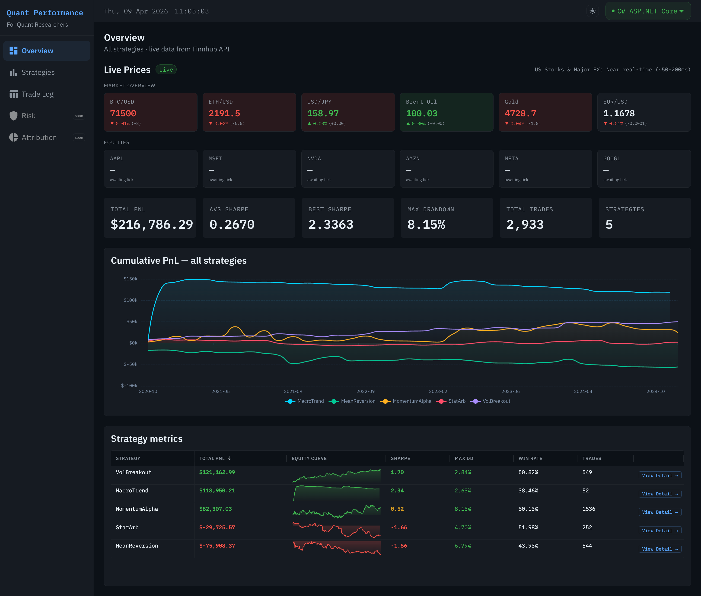
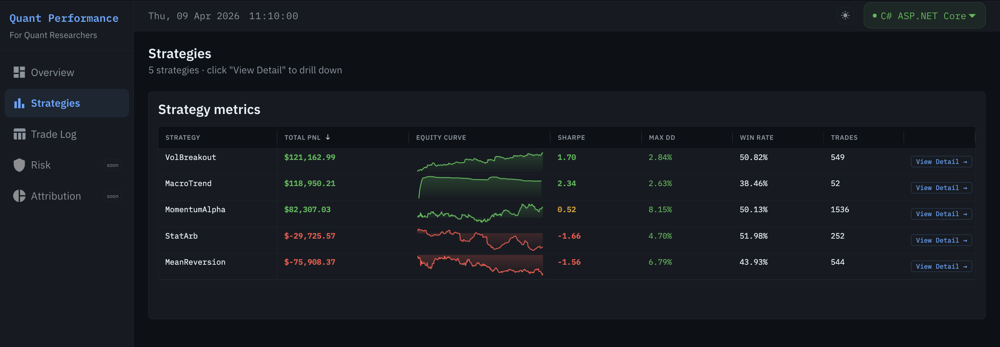
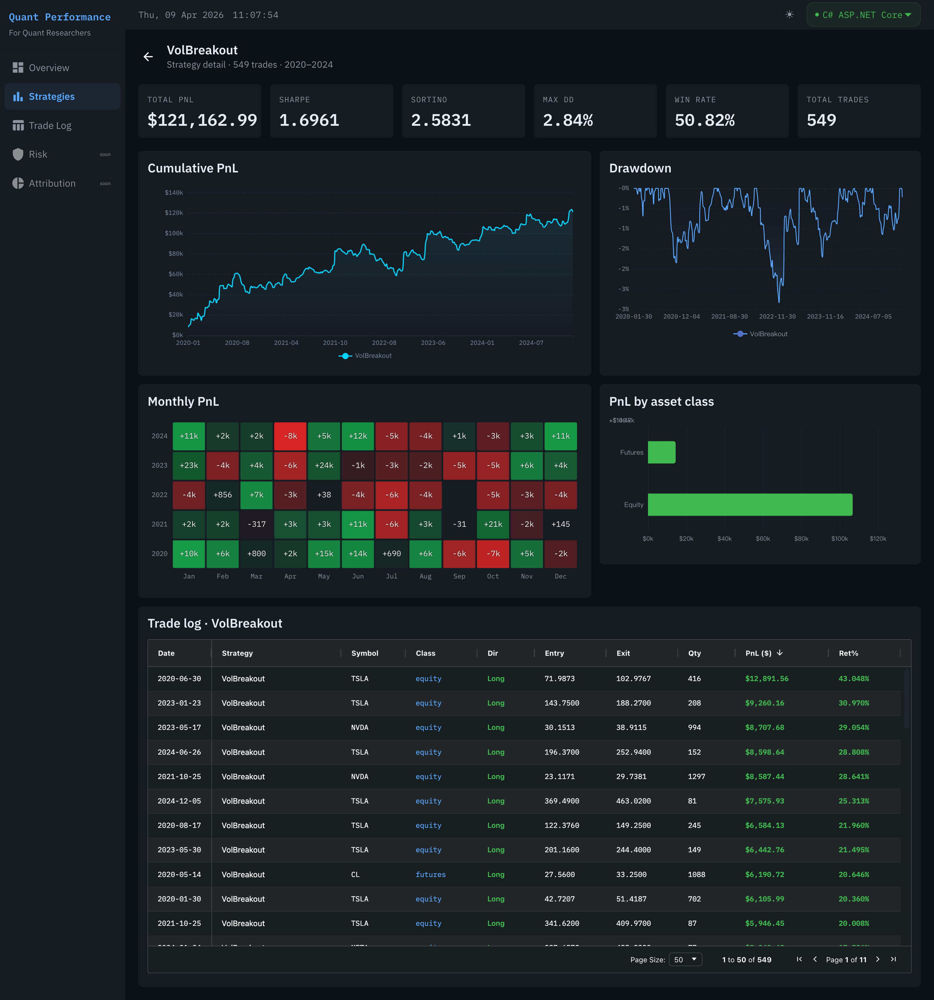
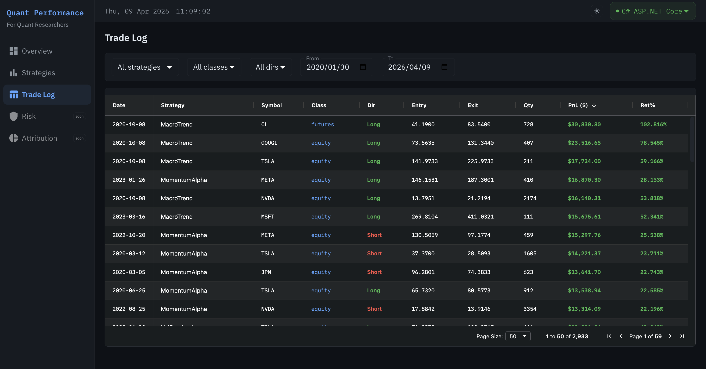

# Quant Performance Dashboard

A full-stack quantitative trading analytics platform built to simulate the internal reporting tools used at systematic investment firms. Delivers daily trading insights across **5 strategies** and **18 asset classes** (equity, futures, forex) with **2,933 real-market trades** sourced from Yahoo Finance (2020–2024) — and live market prices streamed via Finnhub WebSocket.

**Live Demo:** [your-demo-url.com](https://your-demo-url.com) &nbsp;|&nbsp; **Tech stack:** C# · Python · React · MUI · AG-Grid · ECharts · PostgreSQL

---

## Architecture

```
┌─────────────────────────────────────────────┐
│           React Dashboard (Vite)            │
│     MUI v5 · AG-Grid · ECharts · TypeScript │
└──────────┬──────────────────────┬───────────┘
           │ REST + WebSocket      │ REST
           ▼                       ▼
┌──────────────────┐   ┌──────────────────────┐
│  C# ASP.NET Core │   │   Python FastAPI      │
│  EF Core · Swagger│   │  SQLAlchemy · asyncpg│
│  BackgroundService│   │  Pydantic v2 · Uvicorn│
└────────┬─────────┘   └──────────┬───────────┘
         │                         │
         │   identical REST contract (camelCase JSON)
         │                         │
         └──────────┬──────────────┘
                    ▼
           ┌─────────────────┐
           │   PostgreSQL    │
           │  5 tables       │
           │  2,933 trades   │
           └────────▲────────┘
                    │
         ┌──────────────────────────┐
         │    Python data pipeline   │
         │  Yahoo Finance · pandas   │
         │  5 real trading strategies│
         └──────────────────────────┘

Finnhub WebSocket ──► C# BackgroundService ──► frontend live prices
```

The frontend can switch between the C# and Python backends at runtime via a dropdown in the top bar — **zero frontend code changes required.**

---

## Screenshots

> Overview — KPI cards, live prices, multi-strategy equity curves, strategy metrics with sparklines



> Strategies — AG-Grid with ECharts sparkline per row, View Detail drill-down



> Strategy Detail — single strategy deep-dive with equity curve, drawdown, monthly PnL heatmap, asset breakdown



> Trade Log — AG-Grid 2,933 records, client-side pagination, multi-filter



---

## Pages

| Page | Purpose | Key components |
|---|---|---|
| Overview | 30-second global view | KPI cards · Live Ticker · Equity curves · Strategy metrics |
| Strategies | All strategies with drill-down | AG-Grid + ECharts sparkline · View Detail → |
| Strategy Detail | Single strategy deep-dive | Equity curve · Drawdown · Monthly heatmap · Asset breakdown · Trade log |
| Trade Log | Full trade history explorer | AG-Grid 2,933 rows · multi-filter · client pagination |
| Risk | *(coming soon)* | Historical VaR · correlation matrix |
| Attribution | *(coming soon)* | PnL by asset class · time attribution |

---

## Key Technical Decisions

### Dual interchangeable backends
Both C# and Python backends expose the **identical REST API contract** — same routes, same camelCase JSON field names. The React frontend switches between them via a single Vite proxy target change. Both backends implement the same API contract, enabling hot-swap without any frontend changes.

**Problem encountered:** After implementing the Python backend, all dashboard metrics rendered as `NaN`. Root cause: Pydantic serialises fields as `snake_case` by default (`total_pnl`), while C#'s JSON serialiser outputs `camelCase` (`totalPnl`). Fixed by adding `alias_generator=to_camel` to a shared `CamelModel` base class, unifying both backends' output format.

### Drawdown calculation — fixing the 854% bug
Initial implementation:
```python
drawdown = (peak - current) / abs(cumulative_pnl)
```
When cumulative PnL approaches zero early in the backtest, the denominator collapses and drawdown exceeded **854%** — clearly wrong.

**Fix:** Use portfolio value as the denominator. With AUM = $1,000,000, the denominator is always ≥ $1,000,000.
```python
portfolio_value = AUM + cumulative_pnl
drawdown = (peak_portfolio - portfolio_value) / peak_portfolio
```

### Real market data — Yahoo Finance pipeline
The data pipeline was rebuilt from GBM random simulation to **real 2020–2024 market prices** via `yfinance`. Five strategy implementations with genuine trading logic:

| Strategy | Logic | Assets |
|---|---|---|
| MomentumAlpha | Weekly cross-sectional momentum, long top 3 / short bottom 3 | All equities |
| MeanReversion | Bollinger Band (2σ) entry, 5-day max hold | AAPL · MSFT · NVDA · AMZN |
| StatArb | Pairs trading AAPL/MSFT + NVDA/AMZN, z-score ±1.5σ | 2 pairs |
| MacroTrend | MA50/MA200 golden-cross trend following | Futures · Forex |
| VolBreakout | ATR breakout entry, 2×ATR stop-loss, 10-day hold | Equities · Futures |

### ECharts sparkline in AG-Grid cell
Strategy metrics table embeds a mini equity curve per row using a custom `SparklineCellRenderer` — ECharts initialised inside an AG-Grid cell with `ResizeObserver` so the chart reflows when the column is resized. No Enterprise licence required.

### Dynamic date range — data-driven UI
The Trade Log date picker derives its `min`/`max` constraints from `GET /api/trades/date-range`, which queries the actual earliest and latest trade dates from PostgreSQL. Switching datasets requires zero UI changes.

### Dark / Light mode
Full theme switching via a `ThemeModeProvider` context. MUI theme, ECharts chart colours, and AG-Grid Balham theme all respond to the same mode toggle. Preference persisted in `localStorage`.

### Finnhub WebSocket — C# BackgroundService
A persistent upstream WebSocket connection to Finnhub is maintained by a .NET `BackgroundService`. Price ticks are broadcast to all connected React clients. The frontend reconnects automatically on disconnect.

**Symbol groups:**
- Market Overview: BTC/USD · ETH/USD · Brent Oil · Gold · EUR/USD · GBP/USD *(24h real-time)*
- Key Equities: AAPL · MSFT · NVDA · AMZN · META · GOOGL *(active 14:30–21:00 UK)*

---

## Project Structure

```
Quant-performance-dashboard/
├── dashboard/                  # React frontend
│   └── src/
│       ├── api/                # Axios client + endpoint modules
│       ├── components/
│       │   ├── charts/         # EquityCurveChart · DrawdownChart · MonthlyHeatmapChart
│       │   │                   # AssetBreakdownChart · LivePriceTicker · SparklineCellRenderer
│       │   ├── tables/         # StrategyMetricsGrid · TradeLogGrid
│       │   └── layout/         # AppShell · Sidebar · TopBar
│       ├── context/            # BackendContext · ThemeContext
│       ├── hooks/              # useStrategies · usePerformance · useTrades · useMarketData
│       ├── pages/              # Overview · Strategies · StrategyDetail · TradeLog
│       └── types/              # TypeScript interfaces mirroring C# DTOs
│
├── api-csharp/                 # C# ASP.NET Core API
│   ├── Controllers/            # Strategies · Trades · Performance · MarketData
│   ├── Repositories/           # Repository pattern with EF Core
│   ├── Services/               # FinnhubWebSocketService · MarketDataBroadcaster
│   └── DTOs/                   # camelCase response shapes
│
├── api-python/                 # Python FastAPI (identical contract)
│   ├── routers/                # strategies · trades · performance
│   ├── models/schemas.py       # Pydantic v2 with camelCase alias
│   └── db/session.py           # Async SQLAlchemy
│
└── data-pipeline/              # Data generation
    ├── generate_data.py        # GBM simulation (baseline)
    ├── generate_data_yfinance.py  # Yahoo Finance real data (recommended)
    └── requirements.txt
```

---

## Database Schema

```sql
assets            -- 18 instruments: equity, futures, forex
strategies        -- 5 strategies
trades            -- 2,933 real-market trade records (2020–2024)
daily_performance -- Daily PnL, cumulative PnL, drawdown per strategy
strategy_metrics  -- Sharpe, Sortino, max drawdown, win rate, profit factor
```

### Metrics calculated
| Metric | Formula |
|---|---|
| Sharpe Ratio | `√252 × mean(excess_return) / std(excess_return)` |
| Sortino Ratio | `√252 × mean(excess_return) / std(downside_returns)` |
| Max Drawdown | `max((peak_portfolio - portfolio) / peak_portfolio)` |
| Win Rate | `count(pnl > 0) / total_trades` |
| Profit Factor | `sum(winning_pnl) / abs(sum(losing_pnl))` |

---

## Getting Started

### Prerequisites
- PostgreSQL 14+
- Python 3.10+
- Node.js 18+
- .NET 10

### 1. Generate data

```bash
cd data-pipeline
cp .env.example .env
pip install -r requirements.txt

# Option A — real Yahoo Finance data (recommended)
python generate_data_yfinance.py

# Option B — GBM simulation
python generate_data.py
```

### 2. Start C# API

```bash
cd api-csharp
# appsettings.json: set DB connection string + Finnhub API key
dotnet run
# → http://localhost:5000
# → http://localhost:5000/swagger
```

### 3. Start Python API (optional — interchangeable)

```bash
cd api-python
cp .env.example .env
pip install -r requirements.txt
uvicorn main:app --reload --port 8000
# → http://localhost:8000/docs
```

### 4. Start the dashboard

```bash
cd dashboard
npm install
npm run dev
# → http://localhost:5173
```

Switch backends via the dropdown in the top-right corner. Toggle dark/light mode via the sun/moon icon.

---

## API Endpoints

Both backends expose identical routes:

| Method | Route | Description |
|---|---|---|
| GET | `/api/strategies` | All strategies |
| GET | `/api/strategies/metrics` | Summary metrics — AG-Grid table |
| GET | `/api/strategies/metrics-with-equity` | Metrics + equity history array for sparklines |
| GET | `/api/strategies/{id}/metrics` | Single strategy metrics |
| GET | `/api/trades` | Paginated + filtered trade log |
| GET | `/api/trades/symbols` | Symbol list for filter dropdowns |
| GET | `/api/trades/date-range` | Min/max trade dates (data-driven calendar) |
| GET | `/api/performance/equity-curve` | Daily cumulative PnL per strategy |
| GET | `/api/performance/asset-breakdown` | PnL by asset class (strategy filter supported) |
| GET | `/api/performance/monthly` | Monthly PnL summary (strategy filter supported) |
| GET | `/api/market/ws` | WebSocket — Finnhub live prices (C# only) |

---

## Tech Stack

| Layer | Technology |
|---|---|
| Frontend | React 18 · TypeScript · Vite |
| UI components | MUI v5 |
| Data tables | AG-Grid Community 31 (Balham dark theme) |
| Charts | Apache ECharts 5 |
| C# backend | ASP.NET Core · Entity Framework Core · Npgsql |
| Python backend | FastAPI · SQLAlchemy 2.0 · asyncpg · Pydantic v2 |
| Database | PostgreSQL |
| Data pipeline | Python · pandas · NumPy · yfinance |
| Live data | Finnhub WebSocket API |

---

## Built For

Portfolio project targeting the **Quantitative Developer (C#, React)** role at systematic investment firms. The architecture mirrors the real-world scenario in such JDs: delivering daily trading insights and strategy performance feedback to quantitative researchers across multiple asset classes and time horizons.
